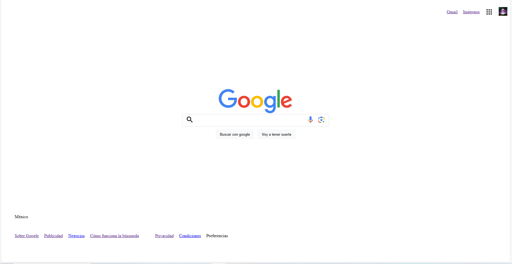

# Clon de google

Hecho por Nessd00dle en TecnolochicasPRO.
Proyecto realizado con la intención de aplicar los conocimientos obtenidos en el bootcamp de Technolochicas PRO.

Dentro del desarrollo del proyecto, incluíremos notas impotantes para tí que me estás leyendo para replicalo y poner en marcha tu aprendizaje.

## ÍNDICE

1. Intro
2. Demo
3. Objetivos de aprendizaje
4. Requisitos para desarrollar el proyecto

**** 

## Intro

El proyecto se centra en la recreación y clonación de la interfaz de usuario emblemática de Google, con el objetivo de comprender en detalle su estructura, funcionalidad y diseño.
Con un enfoque principal en los fundamentos de HTML y CSS, esta iniciativa busca explorar y aplicar estos lenguajes de marcado y estilos para replicar la estética y estructura de la interfaz de búsqueda de Google. A través de este desafío, se pretende sumergirse en los conceptos básicos de diseño web, aprendiendo a estructurar elementos con HTML y darles vida visual con CSS. 

****
## Demostración

****
## Objetivos de aprendizaje

Este proyecto tiene como objetivo principal recrear la interfaz de Google utilizando conceptos básicos de HTML y CSS. Se enfoca en desarrollar habilidades prácticas al trabajar con etiquetas HTML para estructurar la página y aplicar estilos con CSS para lograr la apariencia visual similar a la plataforma original de Google. Además de la clonación visual, se busca comprender la disposición de elementos en la interfaz, practicar la maquetación responsiva y explorar técnicas simples pero efectivas para lograr la funcionalidad básica de la página. 

## Requisitos para desarrollar el proyecto
Código en HTML  y CSS (propiedad de display).

Hecho por Vanessa  Reyes en TecnolochicasPRO.